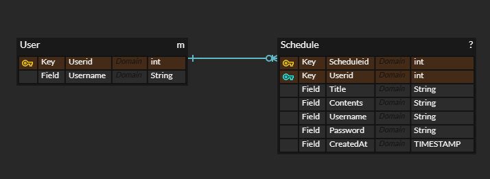
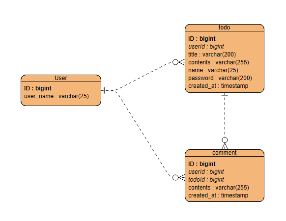

### Goal
회원가입, 로그인 기능이 있는 투두앱 백엔드 서버 만들기

## ERD

- 전에 구현했던 ERD, user 테이블이 있지만 다이어그램 상에서만 존재.

### 추가되는 entity : comment

|   댓글필드    |  데이터 유형   |
|:---------:|:---------:|
| 아이디(고유번호) |  bigint   |
|   댓글내용    |  varchar  |
|  사용자 아이디  |  varchar  |
|  일정 아이디   |  bigint   |
|   작성일자    | timestamp |

comment 테이블까지 추가된 ERD
- User
  - 하나의 user는 todo를 여러개 작성할 수 있으므로 OneToMany
  - 하나의 user는 comment를 여러개 작성 할 수 있으므로 OneToMany
- todo
  - 여러개의 todo가 하나의 user에 의해 작성되므로 ManyToOne
  - 하나의 todo는 여러개의 comment를 가질 수 있으므로 OneToMany

- comment
  - 여러개의 comment가 하나의 user에 의해 작성되므로 ManyToOne 
  - 여러개의 comment가 하나의 todo에 의해 작성되므로 ManyToOne