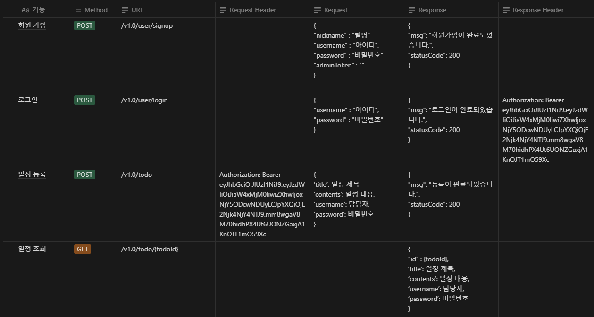

### Goal
회원가입, 로그인 기능이 있는 투두앱 백엔드 서버 만들기

## ERD
### 수정된 ERD


## API 명세서



## 1단계 : 일정과 댓글의 연관관계
### 설명

- 지난 과제에서 만든 일정에 댓글을 추가할 수 있습니다.
- ERD에도 댓글 모델을 추가합니다.
- 각 일정에 댓글을 작성할 수 있도록 관련 클래스를 추가하고 연관 관계를 설정합니다.
- 매핑 관계를 설정합니다. (1:1 or N:1 or N:M)

### 추가되는 entity : Comment

|   댓글필드    |  데이터 유형   |
|:---------:|:---------:|
| 아이디(고유번호) |  bigint   |
|   댓글내용    |  varchar  |
|  사용자 아이디  |  varchar  |
|  일정 아이디   |  bigint   |
|   작성일자    | timestamp |

- User
  - 하나의 user는 todo를 여러개 작성할 수 있으므로 OneToMany
  - 하나의 user는 comment를 여러개 작성 할 수 있으므로 OneToMany
- todo
  - 여러개의 todo가 하나의 user에 의해 작성되므로 ManyToOne
  - 하나의 todo는 여러개의 comment를 가질 수 있으므로 OneToMany

- comment
  - 여러개의 comment가 하나의 user에 의해 작성되므로 ManyToOne 
  - 여러개의 comment가 하나의 todo에 의해 작성되므로 ManyToOne

### 수정되는 entity : User
|  사용자 필드   |  데이터 유형   |
|:---------:|:---------:|
| 아이디(고유번호) |  bigint   |
|    별명     |  varchar  |
|  사용자 이름   |  varchar  |
|   비밀번호    |  varchar  |
|    권한     |  varchar  |
|    생성일    | timestamp |

### 수정되는 entity : Todo
User 테이블이 생기면서 기존 Todo에 존재하는 password field가 중복된다고 판단.

|            일정 필드            |     데이터 유형     |
|:---------------------------:|:--------------:|
|          아이디(고유번호)          |     bigint     |
|           사용자 이름            |    varchar     |
|             제목              |    varchar     |
|             내용              |    varchar     |
| <span style="color:red">비밀번호</span> | <span style="color:red">varchar</span> |
|             생성일             |   timestamp    |


## 2단계 : 댓글 등록
### 기능
- 선택한 일정이 있다면 댓글을 등록합니다.

### 조건

- 댓글이 등록되었다면 client에게 반환합니다.
- 선택한 일정이 DB에 저장되어 있어야 합니다.
- 댓글을 식별하는 `고유번호`, `댓글 내용`, 댓글을 작성한 `사용자 아이디`, 댓글이 작성된 `일정 아이디`, `작성일자`를 저장할 수 있습니다.


### ⚠️ 예외 처리

- 선택한 일정의 ID를 입력 받지 않은 경우
```java
CommentService.createComment
// todoRepository에서 id로 조회 및 예외처리
Todo todo = todoRepository.findById(dto.getTodo().getTodoId()).orElseThrow(()->
                 new NullPointerException("잘못된 접근입니다."));
```
- 댓글 내용이 비어 있는 경우
```java
CommentRequestDTO

// validation으로 예외처리
@NotBlank
private String content;
```
- 일정이 DB에 저장되지 않은 경우
```java
CommentService.createComment

// save 후 commentRepository에서 조회 및 예외처리
commentRepository.save(comment);
        return commentRepository.findById(comment.getCommentId()).orElseThrow(()
        -> new IllegalArgumentException("저장에 오류가 발생했습니다."));
```

## 3단계 : 댓글 수정
### 기능

- 선택한 일정의 댓글을 수정합니다.

### 조건

- 댓글이 수정되었다면 수정된 댓글을 반환합니다.
- `댓글 내용`만 수정 가능합니다.
- 선택한 일정과 댓글이 DB에 저장되어 있어야 합니다.


### ⚠️ 예외 처리

- 선택한 일정이나 댓글의 ID를 입력 받지 않은 경우
- 일정이나 댓글이 DB에 저장되지 않은 경우
- 선택한 댓글의 사용자가 현재 사용자와 일치하지 않은 경우

위와 다르지 않음.

## 4단계 : 댓글 삭제
### 기능

- 선택한 일정의 댓글을 삭제합니다.

### 조건

- 성공했다는 메시지와 상태 코드 반환하기
- 선택한 일정과 댓글이 DB에 저장되어 있어야 합니다.


### ⚠️ 예외 처리

- 선택한 일정이나 댓글의 ID를 입력받지 않은 경우
- 일정이나 댓글이 DB에 저장되지 않은 경우
- 선택한 댓글의 사용자가 현재 사용자와 일치하지 않은 경우

## 5단계 : JWT
### 기능

- JWT를 이용한 인증/인가를 구현한다.
- 위 1~4 단계에서 인증/인가가 완료된 후에만 기능이 동작하도록 수정한다.

### 조건

- Access Token 만료시간 60분
- Refresh Token 구현은 8단계이므로 이번에는 하지 않습니다.

### ⚠️ 예외 처리

- 공통조건
  - StatusCode : 400
  - client에 반환
- 토큰이 필요한 API 요청에서 토큰을 전달하지 않았거나 정상 토큰이 아닐 때
  - 에러 메세지 : 토큰이 유효하지 않습니다.
- 토큰이 있고, 유효한 토큰이지만 해당 사용자가 작성한 게시글/댓글이 아닐 때
  - 에러 메세지 : 작성자만 삭제/수정할 수 있습니다.
- DB에 이미 존재하는 `username`으로 회원가입을 요청할 때
  - 에러 메세지 : 중복된 `username` 입니다.
- 로그인 시, 전달된 `username`과 `password` 중 맞지 않는 정보가 있을 때
  - 에러 메시지 : 회원을 찾을 수 없습니다.

## 6단계 : 회원가입
### 기능

- 사용자의 정보를 전달 받아 유저 정보를 저장한다.

### 조건

- 패스워드 암호화는 하지 않습니다.
  - `PasswordEncoder()` 사용할 필요없음
- `username`은  `최소 4자 이상, 10자 이하이며 알파벳 소문자(a~z), 숫자(0~9)`로 구성되어야 한다.
- `password`는  `최소 8자 이상, 15자 이하이며 알파벳 대소문자(a~z, A~Z), 숫자(0~9)`로 구성되어야 한다.
```java
// 정규식을 이용한 제약조건
    @NotBlank
    @Pattern(regexp = "^[a-z0-9]{4,10}$")
    private String username;

    @NotBlank
    @Pattern(regexp = "^[A-Za-z0-9]{8,15}$")
    private String password;
```
- DB에 중복된 `username`이 없다면 회원을 저장하고 Client 로 성공했다는 메시지, 상태코드 반환하기


## 7️⃣단계 - 로그인

-

### 기능

  - `username`, `password` 정보를 client로부터 전달받아 토큰을 반환한다.

### 설명

  - DB에서 `username`을 사용하여 저장된 회원의 유무를 확인한다.
    - 저장된 회원이 있다면 `password` 를 비교하여 로그인 성공 유무를 체크한다.

### 조건

  - 패스워드 복호화는 하지 않습니다.
  - 로그인 성공 시 로그인에 성공한 유저의 정보와 JWT를 활용하여 토큰을 발급한다.
  - 발급한 토큰을 `Header`에 추가하고 성공했다는 메시지 및 상태코드와 함께 client에 반환한다.

## 7단계 : 로그인
### 기능

- `username`, `password` 정보를 client로부터 전달받아 토큰을 반환한다.

### 설명

- DB에서 `username`을 사용하여 저장된 회원의 유무를 확인한다.
  - 저장된 회원이 있다면 `password` 를 비교하여 로그인 성공 유무를 체크한다.

### 조건

- 패스워드 복호화는 하지 않습니다.
- 로그인 성공 시 로그인에 성공한 유저의 정보와 JWT를 활용하여 토큰을 발급한다.
- 발급한 토큰을 `Header`에 추가하고 성공했다는 메시지 및 상태코드와 함께 client에 반환한다.

